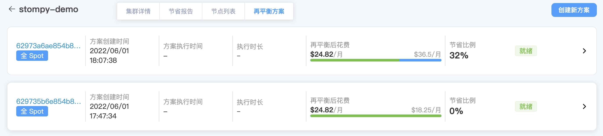
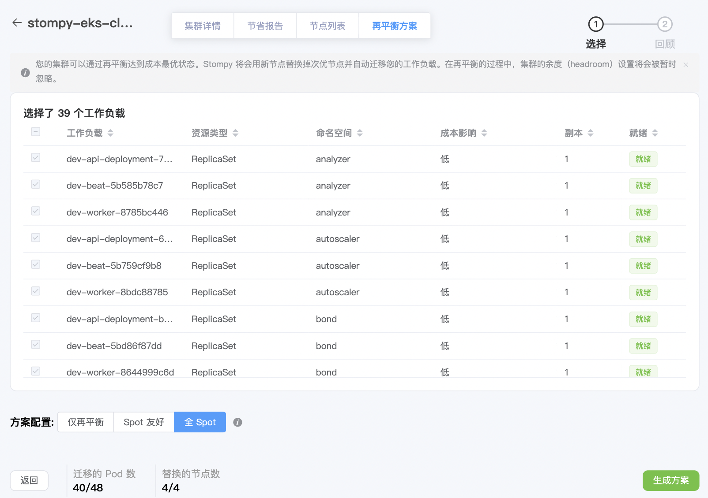

## 再平衡

集群在经过多次自动扩缩容以后常常会留下过于碎片化的部署方案。当集群里实例的 CPU 和内存（memory）资源不能被有效
利用的时候，我们便可以通过再平衡产品，对当前集群的整体资源需求进行分析，优化当前集群大小和实例类型，来实
现节省。

### 准备工作

如想要最大化利用再平衡方案实现节省， 集群需要满足以下几个要求：

  * Pod 模版明确标出所需资源，如 CPU： 500m， memory：200mi。
  * 减少自定义 node selector/node affinity。 我们支持自动识别部分 [well known labels](https://kubernetes.io/zh/docs/reference/labels-annotations-taints/)， 
      但是过多的 node selector 条件会影响再平衡优化的空间
  * 再平衡适用场景为中等大小及以上集群。当集群数量较小以及使用了 t 系列实例，再平衡方案给您带来的优化将非常有限

### 创建再平衡方案

在集群再平衡方案页面中点击'创建新方案' 进入创建页面。

在以下页面您将看到可以被再平衡的工作负载（workloads）， 如果 workloads 被标记为未就绪， 请清理自定义 node selector/node affinity 设置

所有包含未就绪 workloads 的 node 将无法被替换，会出现在优化后的集群配置。

我们会分析已就绪的 workloads，通过我们算法分析出最优分配方案。

用户可以选择三种不同方案配置来生成不同方案：
  
  1. 再平衡： 仅通过重新分配 workloads 来优化集群
  2. Spot 友好： 在再平衡方案基础上，将部分 replica set workloads 部署至 Spot 实例
  3. 仅 Spot：在再平衡方案基础上，全部使用 Spot 实例

### 执行再平衡方案

执行再平衡方案过程中可能会短暂造成服务不可用， 建议您在系统维护时间在进行操作。

您可以选择重新创建或者滚动更新来执行方案：

- 重新创建：我们将会在创建完方案所需的新资源后直接删除您原有的节点组。 该过程将短暂造成服务不可用。
- 滚动更新：我们将先开启新的实例，并将选中工作负载复制到新的实例组，确保工作负载已经正常部署完毕后，旧的实例将会被终止。该过程将最大化保证服务可用性，但会产生一定的额外花销。

再平衡方案执行完后，您将会看到方案状态转换为已激活（Active）。
