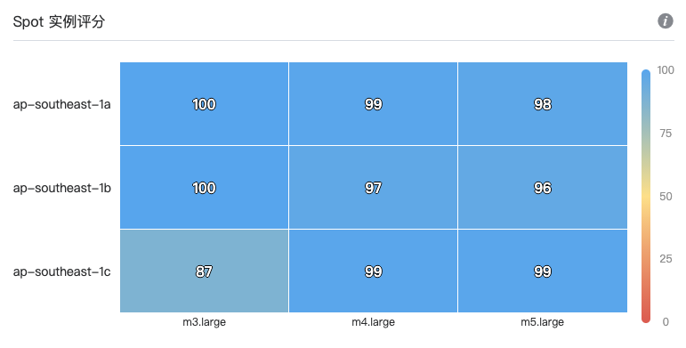

# SpoTainer

### 一、简介

SpoTainer 组简化和自动化您在云上基础设施横向扩展的流程，将运维团队从繁琐的基础设施管理负担中解放出来，我们将持续监控并分析您的资源使用情况，并且利用机器学习和算法来为您实现确保可用性下最低成本的自动扩展。

 

### 二、如何工作

#### Spot 实例评分

AWS 中的 Spot 市场被定义为特定实例类型、特定可用区中特定实例价格、特定产品 (Linux/Windows) 的供求关系。SpoTainer 根据 Spot 实例实时可用性数据和成本历史数据对 Spot 市场进行排名，综合各个 Spot 市场评分，助您选出价格和可用性最佳平衡的实例。

<!-- #### AMI 自动备份

SpoTainer 组将对最新运行的实例按照选定更新频率持续创建镜像，并使用最新镜像以更新替换组内实例。默认情况下我们会存储每个实例最新的三个镜像。我们还将实时监控组中实例的状态，一旦检测到实例中断，将自动从最新实例镜像中恢复实例。

 -->

#### 自动替换不健康实例

您可以选择将使用哪个运行状况检查服务来确定是否替换未通过检查的实例，如果实例未通过所选健康检查，它会自动被替换为新实例。

#### 自动扩展策略

SpoTainer 组的预测性自动扩展简化了定义扩展策略，识别请求高峰时间，和自动扩展以确保可用容量的过程。机器学习算法可通过对不同流量模式进行分类，将应用不同的时间序列预测模型来生成预测，以在实际扩展前有充足的时间来启动和设置新实例。详情可看 [DMAS 策略使用文档](DMAS-documentation.md?id=dynamic-multi-level-autoscaling-strategy-dmas)。

<!-- #### 实例中断管理

若 Spot 实例不可用，我们将会恢复按需实例，直到 Spot 实例可用，我们将第一时间切换回 Spot 实例，在保证可用性的条件下以为您提供最大节省。 -->

#### 可用区平衡

SpoTainer 组支持高可用性部署结构，允许您在单个区域的多个可用区中均匀分布实例，这将保证所有选定可用区的容量相等。在创建或扩展 SpoTainer 组时，创建新实例之前，我们将检查当前实例的分布，根据组中当前选择的可用区，我们将在所选可用区间以均匀分布的方式启动实例。缩减 SpoTainer 组时，在终止实例之前，我们也将根据当前实例在可用区的分布终止实例，以使它们保持平均分配。

### 三、如何使用

#### 连接 AWS 账号

- [第一次登录如何连接 AWS 账号](connect-aws-account.md?id=第一次登录如何连接-aws-账号？)

- [如何添加 StompyAnalySaver 权限](connect-aws-account.md?id=第三步：添加-stompyanalysaver-权限)

- [如何添加 StompySpoTainer 权限](connect-aws-account.md?id=第四步：添加-stompyspotainer-权限)

#### 从 AWS 现有 Auto Scaling Group 导入配置

- [如何从 ASG 中导入配置](md/how-to-import-from-ASG.md?id=从现有-auto-scaling-group-中导入配置)

#### 创建新的 SpoTainer 组

- [如何创建新的 SpoTainer 组](md/how_to_create_spotainer_group.md?id=如何创建新的spotainer组) 

