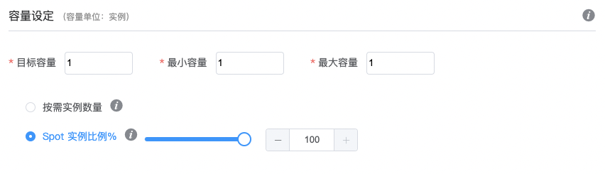
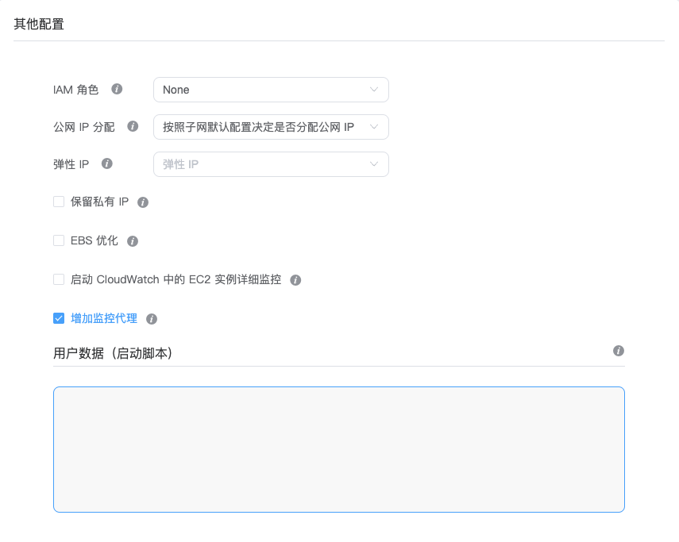
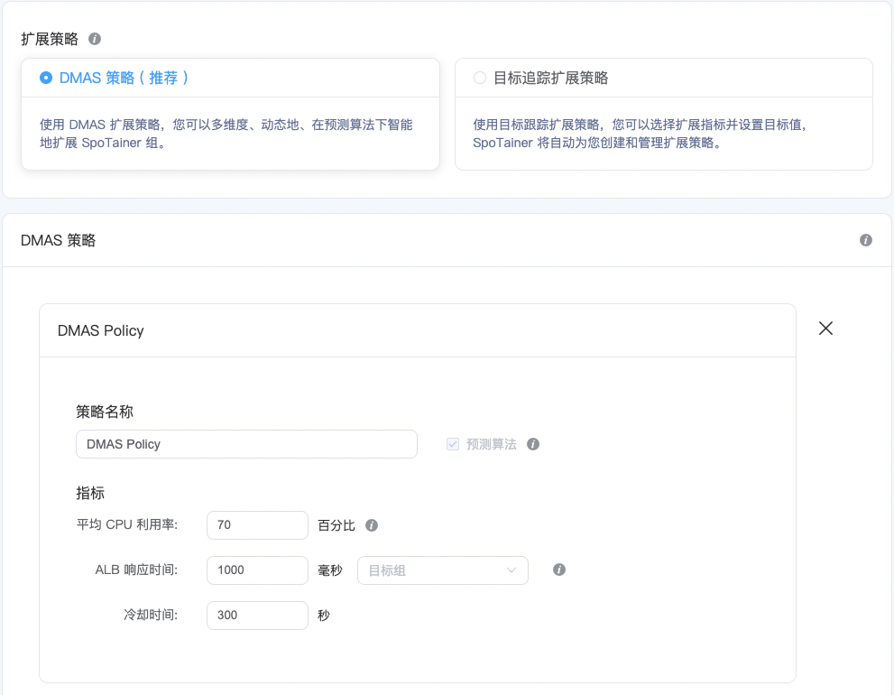
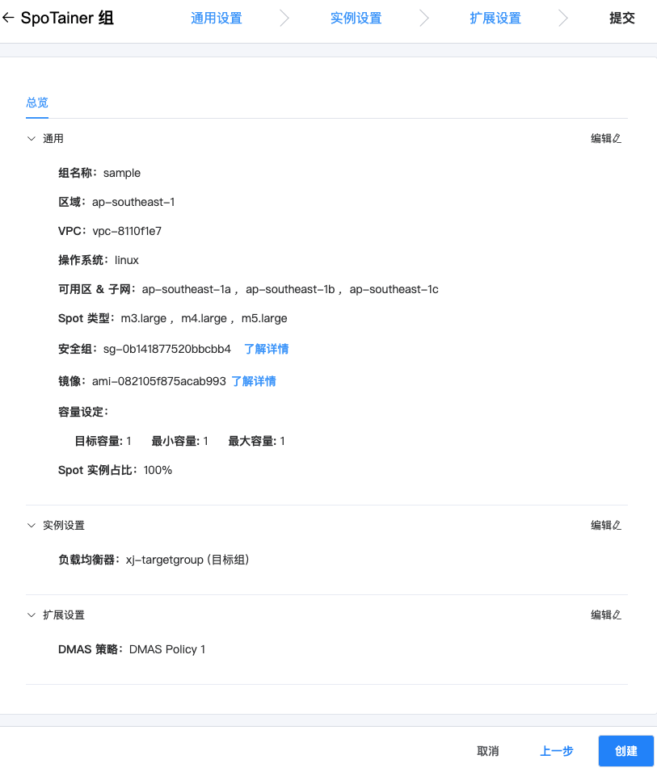

# 如何创建新的SpoTainer组

此文档将描述如何从空模板创建新的SpoTainer组。

### 要求：

- 已连接 AWS 账号的 Stompy 账号。

### 步骤：

1. 在页面左侧菜单栏点击“组信息”，点击右上角“创建 SpoTainer 组”。

2. 选择“创建一个新 SpoTainer 组”，点击“选择”。

3. 编辑具体配置：

#### 通用设置

- 实例通用设置

  ◦ SpoTainer 组名称：SpoTainer 实例组的名称。

  ◦ 区域：组所在的 AWS 区域。

  ◦ VPC：组所在的 VPC。

  ◦ 操作系统：所需的 EC2 操作系统。

  ◦ 按需实例类型：按需计费的实例类型，以便在指定的 Spot 市场不可用时使用。

  

- 容量设定

  ◦ 目标容量：初始实例数量。

  ◦ 最小容量：允许的最小实例数量。

  ◦ 最大容量：允许的最大实例数量。

  ◦ 按需实例数量：组中所需的按需实例数量。

  ◦ Spot 实例比例：组中所需的 Spot 实例比例。

  

- 可用区&子网

  ◦ 可用区：组中允许使用的可用区。

  > 强烈建议选择多个可用区，以进一步丰富可用的 Spot 实例容量池，增强可用性。

  ◦ 子网：对于每个可用区，需选择至少一个子网。

  

- Spot 实例评分

  根据所选可用区和 Spot 实例类型，展示 Spot 市场的评分。分数范围为 0-100，其中 0 是非可用市场，100 将提供成本最优和可用性最佳的 Spot 市场。

  

- Spot 类型

  允许的 Spot 实例类型（至少需要一种）。

  > 强烈建议选择多个实例类型（具有相似的规格），以确保更丰富的 Spot 市场可供使用。

  

- 启动配置

  ◦ 镜像：选择或输入您要用于 SpoTainer 组的 AMI ID。 公开可用的 AMI 或 AWS 账户中创建的私有 AMI 均可。

  ◦ 安全组：应用到该组实例的安全组。

  ◦ 密钥：进行身份验证以访问实例的密钥。

  

  

#### 实例设置

- 其他配置

  ◦ IAM 角色：组内实例所需的IAM角色。需要先在AWS账号中定义IAM角色后才能使用它。

  ◦ 公网 IP 分配：从 AWS 的公共 IP 地址池请求公共 IP 地址，以使实例可从网络访问。

  ◦ 弹性 IP：可指定一个或多个弹性 IP 与 SpoTainer 组相关联，无论组内实例如何更换，实例将自动关联您指定的弹性 IP。

  ◦ 保留私有 IP 地址：组内实例因中断发生替换时，私有IP保持不变。

  ◦ AMI 自动备份：自动创建镜像和EBS卷快照，如果发生实例替换，SpoTainer组会使用最新镜像开启新实例。

  ◦ EBS 优化：非 EBS 优化实例类型可启用 EBS 优化容量，以为 EBS 服务提供高带宽连接。

  ◦ 启动 CloudWatch 中的 EC2 实例详细监控：对实例启用 CloudWatch 详细监控（以一分钟为数据间隔，默认为五分钟）。

  > 启用详细监控后需要按发送到 CloudWatch 的每个指标付费，定价因区域而异。

  ◦ 增加监控代理：为获取更为详细的数据和更为准确的优化建议，建议您启用用于监控的代理，我们将在启动脚本处自动帮您安装。

  ◦ 用户数据（启动脚本）：指定用户数据来配置实例或在启动实例期间运行配置脚本。

  

- 负载均衡器

  ◦ 目标组：将一个或多个目标组与 SpoTainer 组关联，组内实例将注册到所选目标组。

  

- 运行状况检查

  ◦ 运行状况检查类型：根据您指定的运行状况检查类型，以检查实例的健康状况，并在实例变得不健康时替换它们。

  ◦ 运行状况检查宽限期（秒）：在第一次健康检查之前允许实例启动和应用程序完全启动的时间。

  

  

#### 扩展设置

- DMAS 策略

  ◦ 策略名称：DMAS 策略名称

  ◦ 指标目标值：

     ▪ CPU 利用率：SpoTainer 组内需要使用的CPU资源利用率。

     ▪ 响应时间：特定目标组的最大响应时间，一旦该实际值大于目标值，将会触发扩展动作。

     ▪ 冷却时间：每次扩展动作后需要等待的时间。

  

- 目标追踪扩展策略

  ◦ 策略名称：Target Scaling Policy 1

  ◦ 指标类型：平均CPU 利用率：SpoTainer 组内需要使用的CPU资源利用率。

  ◦ 目标值：组中指标的目标值，指标实际值严重偏离目标值即会触发扩展或缩减动作，以使指标实际值维持在目标值附近。

  ◦ 冷却时间：每次扩展动作后需要等待的时间。

  

- 简单扩展策略

  ◦ 策略名称：Simple Scaling Policy 1

  ◦ 指标类型：平均CPU 利用率：SpoTainer 组内需要使用的CPU资源利用率。

  ◦ 触发阈值：设置将触发扩展和缩减操作的数字。

  ◦ 执行操作：超过阈值时采取的向上扩展行动，低于阈值时采取的向下缩减行动。

  ◦ 更多设置：

     ▪ 统计方法：计算所选周期内指标的平均值。

     ▪ 运算符号：指标实际值和触发阈值间的运算符号。

     ▪ 周期数量：触发扩展条件的连续周期数量。

     ▪ 周期：针对所选指标和触发阈值的监测周期。

     ▪ 冷却时间：每次扩展动作后需要等待的时间。

  

#### 提交

4. 查看并进行必要的修改后，点击“创建”。

